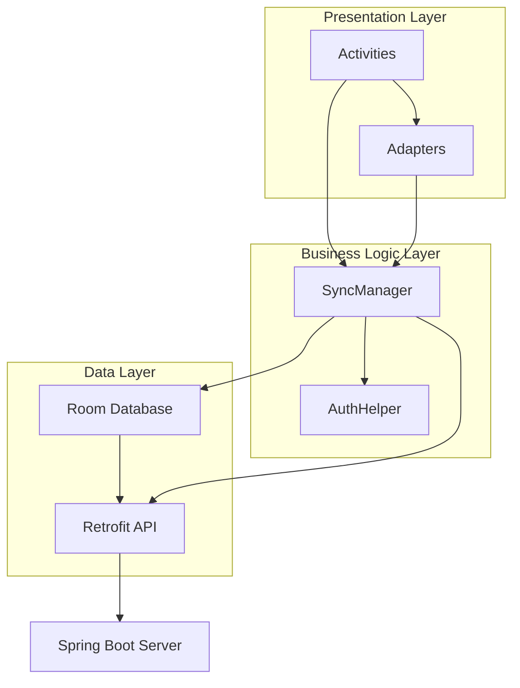

# DL Fashion - Интернет-магазин одежды (Android)

Мобильное приложение для Android, реализующее функционал интернет-магазина одежды с виртуальным гардеробом и системой персональных рекомендаций. Клиентская часть учебного проекта по разработке клиент-серверных приложений.

**Связанные репозитории:**
- [Серверная часть (Spring Boot API)](https://github.com/artem05kz/online_clothing_store_database)

## Содержание
- [Возможности](#возможности)
- [Архитектура](#архитектура)
- [Технологический стек](#технологический-стек)
- [Скриншоты](#скриншоты)
- [Установка и запуск](#установка-и-запуск)
- [Структура проекта](#структура-проекта)

## Возможности

### Для всех пользователей
- Просмотр каталога одежды с фильтрацией по категориям
- Сортировка товаров по цене и рейтингу
- Детальная информация о товаре (описание, состав, размеры)
- Галерея изображений товаров

### Для зарегистрированных пользователей
- Корзина покупок с управлением количеством товаров
- Избранные товары
- Применение промокодов со скидками
- **Виртуальный гардероб** - уникальная функция подбора комплектов одежды из избранного
- Персональные рекомендации на основе рейтинга товаров
- История заказов
- Управление профилем и адресами доставки

### Административные функции
- Добавление, редактирование и удаление товаров
- Управление категориями
- Управление промокодами и акциями

## Архитектура

Приложение построено на трехуровневой клиент-серверной архитектуре:


### Основные компоненты

**Presentation Layer:**
- `MainActivity`, `CatalogActivity`, `CartActivity` - экраны приложения
- `ProductAdapter`, `CartAdapter` - адаптеры для RecyclerView
- `BannerPagerAdapter` - слайдер промо-баннеров

**Business Logic:**
- `SyncManager` - синхронизация данных с сервером
- `AuthHelper` - управление аутентификацией
- `PasswordHasher` - безопасное хеширование паролей (BCrypt)

**Data Layer:**
- `AppDatabase` - Room Database для локального хранения
- `ApiService` - Retrofit интерфейс для работы с REST API
- DAO (Data Access Objects) для каждой сущности

## Технологический стек

- **Язык:** Java
- **SDK:** Android SDK 24+ (Android 7.0+)
- **Архитектура:** MVC (Model-View-Controller)
- **База данных:** Room Database (SQLite)
- **Сеть:** Retrofit 2 + Gson
- **Изображения:** Picasso
- **UI компоненты:** Material Design, RecyclerView, ViewPager2
- **Безопасность:** BCrypt для хеширования паролей
- **Управление зависимостями:** Gradle

### Основные библиотеки
```gradle
// Database
implementation 'androidx.room:room-runtime:2.7.1'

// Network
implementation 'com.squareup.retrofit2:retrofit:2.9.0'
implementation 'com.squareup.retrofit2:converter-gson:2.9.0'

// Image loading
implementation 'com.squareup.picasso:picasso:2.71828'

// Security
implementation 'org.mindrot:jbcrypt:0.4'

// UI
implementation 'me.relex:circleindicator:2.1.6'
implementation 'androidx.work:work-runtime:2.8.1'
```

## Скриншоты

*(Разместите скриншоты основных экранов: каталог, детальная карточка товара, корзина, гардероб, профиль)*

## Установка и запуск

### Предварительные требования

- Android Studio Arctic Fox или новее
- JDK 11+
- Android SDK 24+
- Запущенный сервер API (см. [серверный репозиторий](ссылка))

### Шаги установки

1. **Клонирование репозитория:**
```bash
git clone https://github.com/your-username/online-clothing-store-android.git
cd online-clothing-store-android
```

2. **Настройка API endpoint:**

Откройте `app/src/main/java/com/example/online_clothing_store/api/ApiClient.java` и укажите адрес вашего сервера:
```java
private static final String BASE_URL = "http://YOUR_SERVER_IP:8080/api/";
```

Для локального тестирования:
- Эмулятор Android: `http://10.0.2.2:8080/api/`
- Физическое устройство: `http://YOUR_LOCAL_IP:8080/api/`

3. **Настройка сетевой безопасности:**

Если используете HTTP (не HTTPS), добавьте IP сервера в `app/src/main/res/xml/network_security_config.xml`:
```xml
<domain-config cleartextTrafficPermitted="true">
    <domain includeSubdomains="true">YOUR_SERVER_IP</domain>
</domain-config>
```

4. **Сборка проекта:**
```bash
./gradlew build
```

5. **Запуск на устройстве/эмуляторе:**
- Подключите Android устройство или запустите эмулятор
- Нажмите `Run` в Android Studio или выполните:
```bash
./gradlew installDebug
```

## ⚙️ Конфигурация

### Структура базы данных

Приложение использует Room Database с следующими таблицами:

- `users` - пользователи
- `products` - товары
- `categories` - категории товаров
- `product_images` - дополнительные изображения
- `favorites` - избранные товары
- `cart` - корзина
- `orders` - заказы
- `order_items` - позиции заказов
- `promos` - промокоды

### Синхронизация данных

Приложение автоматически синхронизирует данные с сервером:

- При первом запуске загружаются все товары и категории
- При входе синхронизируются пользовательские данные (избранное, корзина, заказы)
- Изменения отправляются на сервер при наличии интернет-соединения
- Офлайн-режим поддерживается через локальное хранилище Room

### Гостевой режим

Приложение поддерживает просмотр каталога без регистрации. Для доступа к корзине, избранному и гардеробу требуется создать аккаунт.

## Структура проекта
```
app/src/main/java/com/example/online_clothing_store/
├── Adapter/              # RecyclerView адаптеры
│   ├── BannerPagerAdapter.java
│   ├── CartAdapter.java
│   ├── ProductAdapter.java
│   └── RecommendationsAdapter.java
├── api/                  # Retrofit API
│   ├── ApiClient.java
│   └── ApiService.java
├── database/            # Room Database
│   ├── AppDatabase.java
│   ├── dao/            # Data Access Objects
│   └── entities/       # Entity модели
├── sync/               # Синхронизация
│   ├── SyncHelper.java
│   └── SyncManager.java
├── utils/              # Утилиты
│   ├── AuthHelper.java
│   ├── NetworkUtils.java
│   └── PasswordHasher.java
└── *Activity.java      # UI экраны

res/
├── layout/             # XML разметка экранов
├── drawable/           # Иконки и изображения
├── values/             # Строки, цвета, стили
└── xml/               # Конфигурация сети
```

## Особенности дизайна

- **Цветовая схема:** Бежево-коричневая палитра в стиле fashion-бренда
- **Шрифты:** Bebas Neue (заголовки), Actay (основной текст)
- **Material Design** компоненты для современного UX
- **Адаптивная верстка** для различных размеров экранов
- **Анимации** переходов и загрузки изображений

## Безопасность

- Пароли хешируются с использованием BCrypt
- HTTPS поддержка для защищенной передачи данных
- Токены авторизации для сессий пользователей
- Валидация email при регистрации
- Безопасное хранение учетных данных

## API Endpoints

Приложение взаимодействует со следующими эндпоинтами сервера:
```
GET  /api/products              # Получить все товары
GET  /api/categories            # Получить категории
GET  /api/promos                # Получить промокоды
POST /api/users/register        # Регистрация
POST /api/cart/sync             # Синхронизация корзины
POST /api/favorites/sync        # Синхронизация избранного
POST /api/orders/sync           # Синхронизация заказов
PUT  /api/users/{id}            # Обновить профиль
```

Полная документация API доступна в [серверном репозитории](ссылка).

## Тестирование

Приложение прошло тестирование методом черного ящика с группой из 5 тестировщиков. Проверены:

- Регистрация и авторизация
- Просмотр каталога и фильтрация
- Корзина и оформление заказа
- Избранное и виртуальный гардероб
- Применение промокодов
- Синхронизация данных
- Офлайн-режим
